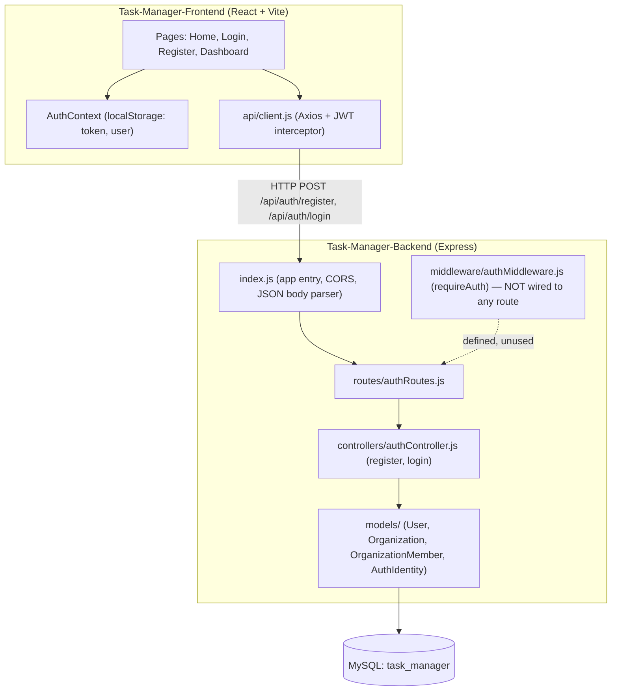
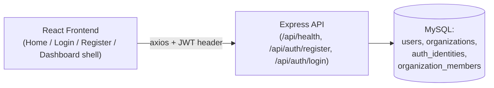
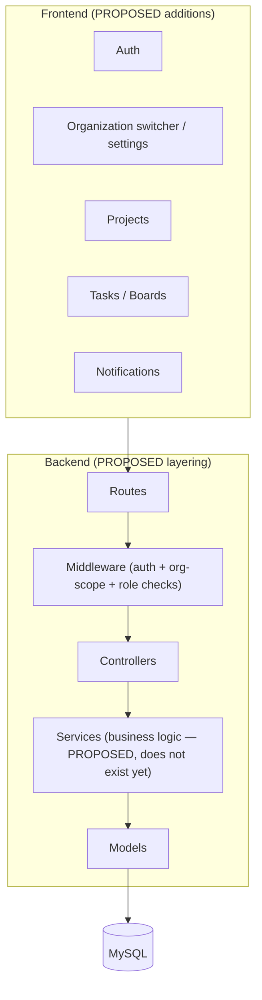
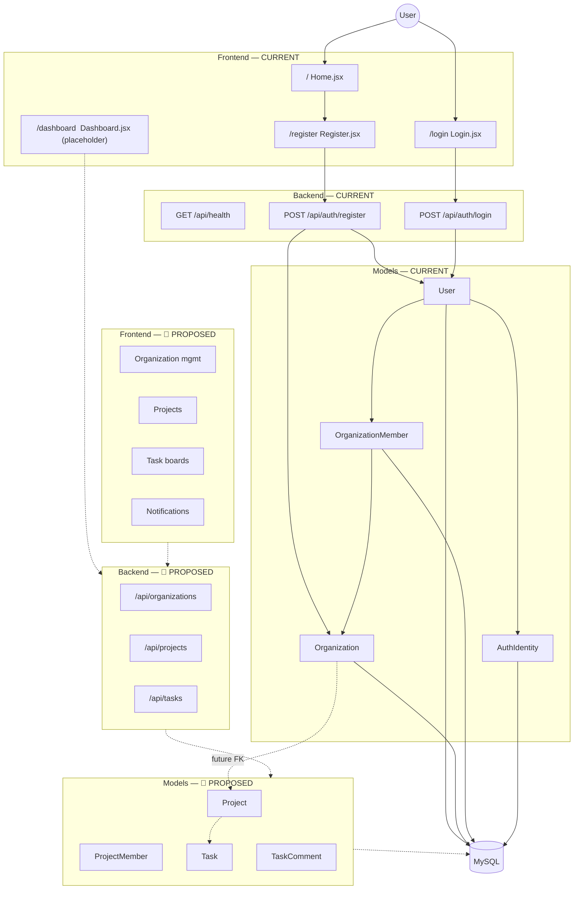

# ARCHITECTURE.md — Task Management System

> Analyzed directly from source on 2026-08-12. Every claim below is traceable to an actual file. Anything that could not be verified from code is marked ❓ UNKNOWN.

---

## 1. Project Overview

**What this application currently does:** It is the skeleton of a multi-tenant task management tool ("Humancare Connect" — see frontend branding in [AuthLayout.jsx](../Task-Manager-Frontend/src/components/AuthLayout.jsx) and [Home.jsx](../Task-Manager-Frontend/src/pages/Home.jsx)). Today it only implements **account signup and login** and renders a placeholder dashboard shell. No project or task functionality exists yet.

**Current development stage:** Early foundation stage — database schema for identity/organizations is modeled and migrated, a minimal Express API exposes register/login, and a React frontend has a landing page, auth forms, and a protected dashboard placeholder.

**Main technologies (from [package.json](../Task-Manager-Backend/package.json) and [package.json](../Task-Manager-Frontend/package.json)):**

| Layer                | Technology                                                       |
| -------------------- | ---------------------------------------------------------------- |
| Backend runtime      | Node.js, Express 4.19                                            |
| Backend language     | JavaScript (CommonJS)                                            |
| Database             | MySQL (via `mysql2` driver)                                      |
| ORM / Migrations     | Sequelize 6 + `sequelize-cli`                                    |
| Auth                 | JSON Web Tokens (`jsonwebtoken`) + password hashing (`bcryptjs`) |
| Frontend             | React 18 (Vite), React Router 6                                  |
| Frontend styling     | Tailwind CSS                                                     |
| Frontend HTTP client | Axios                                                            |

---

## 2. Current Folder Tree

```text
Task Management System
│
├── Task-Manager-Backend
│   ├── config
│   │   ├── config.js          # Sequelize CLI environment config (dev/test/prod)
│   │   └── db.js              # Sequelize connection instance + connectDB()
│   │
│   ├── controllers
│   │   └── authController.js  # register, login
│   │
│   ├── middleware
│   │   └── authMiddleware.js  # requireAuth (JWT verification) — defined but UNUSED
│   │
│   ├── migrations
│   │   ├── 20260812060559-create-organizations.js
│   │   ├── 20260812062230-create-users.js
│   │   ├── 20260812063038-create-auth-identities.js
│   │   └── 20260812063102-create-organization-members.js
│   │
│   ├── models
│   │   ├── User.js
│   │   ├── Organization.js
│   │   ├── OrganizationMember.js
│   │   ├── AuthIdentity.js
│   │   └── index.js           # Defines associations between the 4 models
│   │
│   ├── routes
│   │   └── authRoutes.js      # POST /register, POST /login
│   │
│   ├── .env / .env.example
│   ├── .sequelizerc
│   ├── package.json
│   └── index.js               # App entry point
│
└── Task-Manager-Frontend
    └── src
        ├── api
        │   └── client.js          # Axios instance, attaches JWT from localStorage
        ├── components
        │   ├── AuthLayout.jsx
        │   ├── FormField.jsx
        │   ├── BoardIllustration.jsx
        │   └── ProtectedRoute.jsx # Client-side route guard
        ├── context
        │   └── AuthContext.jsx    # user state + login()/logout(), persisted to localStorage
        ├── pages
        │   ├── Home.jsx
        │   ├── Login.jsx
        │   ├── Register.jsx
        │   └── Dashboard.jsx      # Placeholder only
        ├── App.jsx                # Route table
        └── main.jsx                # React root, wraps App in AuthProvider + BrowserRouter
```

**Files present but not wired into anything:**

- `Task-Manager-Backend/middleware/authMiddleware.js` — exports `requireAuth`, but it is not imported by `authRoutes.js` or any other route file. No backend route currently requires a valid token.
- `Task-Manager-Backend/controllers/.gitkeep`, `middleware/.gitkeep`, `models/.gitkeep`, `routes/.gitkeep` — placeholders, no content.
- `Task-Manager-Backend/README.md` was deleted (per git status) and not replaced — ❓ UNKNOWN what it documented previously.

---

## 3. Logical Architecture Diagram (Current)



---

## 4. User / Organization / Auth Relationship (as modeled)

Per [models/index.js](../Task-Manager-Backend/models/index.js), the intended relationships are:

```text
User (1) ──< AuthIdentity        (user_id FK)      — a user can have multiple login methods (local, google)
User (1) ──< OrganizationMember  (user_id FK)       — a user can belong to multiple organizations
Organization (1) ──< OrganizationMember (organization_id FK)
```

```text
User
 │
 ├── AuthIdentity (1..N)      — holds password_hash / provider ("local" | "google")
 │
 └── OrganizationMember (1..N)
          │
          ▼
      Organization
          role: owner | admin | manager | member | client (stored on OrganizationMember)
```

Answers derived strictly from code:

| Question                                       | Answer                                                                                                                                                                                                                                                                                 |
| ---------------------------------------------- | -------------------------------------------------------------------------------------------------------------------------------------------------------------------------------------------------------------------------------------------------------------------------------------- |
| Can one user belong to multiple organizations? | ✅ Yes — `OrganizationMember` is a join table with a unique `(organization_id, user_id)` index (see [migration](../Task-Manager-Backend/migrations/20260812063102-create-organization-members.js)), i.e., no duplicate membership per org, but a user row can appear in many org rows. |
| How is membership stored?                      | In the `organization_members` table, one row per `(user, organization)` pair.                                                                                                                                                                                                          |
| Where is the role stored?                      | On `OrganizationMember.role`, an ENUM (`owner`, `admin`, `manager`, `member`, `client`) — **not** on `User`.                                                                                                                                                                           |
| Who owns an organization?                      | Modeled as whoever has `OrganizationMember.role = 'owner'` for that org. There is no `owner_id` column on `Organization` itself.                                                                                                                                                       |
| How is organization access checked?            | ❌ NOT IMPLEMENTED — no controller or middleware reads `OrganizationMember` to authorize a request.                                                                                                                                                                                    |
| Is authorization implemented?                  | ❌ NOT IMPLEMENTED — `authMiddleware.js` only verifies the JWT signature; it does not check roles or org membership, and it isn't attached to any route.                                                                                                                               |
| Is multi-tenancy implemented?                  | 🟡 PARTIALLY — the schema supports it (org-scoped membership table), but no query in the codebase currently scopes data by organization.                                                                                                                                               |
| How is the "current organization" determined?  | ❓ UNKNOWN / NOT IMPLEMENTED — there is no concept of an active/selected organization anywhere in the code.                                                                                                                                                                            |

---

## 5. ⚠️ Critical Architectural Finding: Controller/Model Mismatch

**`controllers/authController.js` is written against a schema that no longer matches the current models.** This is the single most important finding in this analysis and is very likely the reason authentication does not actually work right now. Details are in [AUTHENTICATION.md](AUTHENTICATION.md#critical-finding) and [ARCHITECTURAL-PROBLEMS](#architectural-problems-summary) below.

In short:

- `authController.js` calls `User.create({ organization_id, ..., password_hash, role })`.
- The current `User` model ([models/User.js](../Task-Manager-Backend/models/User.js)) has **no** `organization_id`, `role`, or `password_hash` fields — those now live on `OrganizationMember` and `AuthIdentity` respectively.
- Sequelize silently drops unknown attributes on `.create()`, so registration "succeeds" (HTTP 201) but stores no password and creates no organization membership.
- Login then calls `bcrypt.compare(password, user.password_hash)` where `user.password_hash` is `undefined`, which bcryptjs rejects/throws — caught by the generic `catch` block and returned as a `500 Server error during login.`

**Net effect: registration silently produces broken/unusable accounts, and login currently fails for every user.** See [API.md](API.md) for full request/response detail and [DEVELOPMENT-ROADMAP.md](DEVELOPMENT-ROADMAP.md) for the fix priority.

---

## 6. Current vs. Proposed Architecture

### CURRENT (implemented today)



### 🔵 PROPOSED TARGET ARCHITECTURE



Domain chain, current vs. proposed:

```text
User ✅
 └─ AuthIdentity ✅ (schema only — write path broken, see finding above)
      └─ OrganizationMember ✅ (schema only — never populated by any controller)
           └─ Organization ✅ (created, but not linked to its creator as a member)
                └─ Project 🔵 PROPOSED — no model, no route, no controller
                     └─ Task 🔵 PROPOSED — no model, no route, no controller
```

---

## 7. Master Architecture Diagram (Full System, Current + Proposed)



---

## 8. Architectural Problems Summary

See full detail in each dedicated doc. Highest-priority items:

1. **CRITICAL** — `authController.js` writes fields that don't exist on the `User` model (`organization_id`, `role`, `password_hash`); login is functionally broken. See [AUTHENTICATION.md](AUTHENTICATION.md#critical-finding).
2. **HIGH** — Registration never creates an `OrganizationMember` row, so the owner is never actually linked to the organization they just created.
3. **HIGH** — `authMiddleware.js` (`requireAuth`) is defined but not used anywhere; there are currently zero protected backend routes.
4. **MEDIUM** — No authorization/role-check layer exists (org-scoping, role checks).
5. **MEDIUM** — Frontend calls `POST /api/auth/google` (in [Login.jsx](../Task-Manager-Frontend/src/pages/Login.jsx)) for Google sign-in, but no such backend route exists.

Full list in [AUTHENTICATION.md](AUTHENTICATION.md) and [DATABASE.md](DATABASE.md).

---

## 9. Understand This Project in 5 Minutes

1. **What the application is:** An early-stage, multi-tenant task management web app ("Humancare Connect"). Users sign up, which creates a company/organization, and will eventually manage projects and tasks within that organization.

2. **What has already been built:** A MySQL schema (via Sequelize migrations) for `users`, `organizations`, `organization_members`, and `auth_identities`; a small Express API with `register`/`login`; and a React frontend with a landing page, register/login forms, and a placeholder dashboard behind a client-side route guard.

3. **How the backend works:** [index.js](../Task-Manager-Backend/index.js) boots Express, connects to MySQL via Sequelize ([config/db.js](../Task-Manager-Backend/config/db.js)), and mounts `/api/auth` routes. Only two real endpoints exist: `POST /api/auth/register` and `POST /api/auth/login`, both handled in [authController.js](../Task-Manager-Backend/controllers/authController.js).

4. **How authentication works (intended vs. actual):** Intended: password hashed with bcrypt into `AuthIdentity.password_hash`, a JWT issued on success, verified per-request by `authMiddleware.requireAuth`. Actual: the controller still targets an old, flat `User` schema (`password_hash`/`role`/`organization_id` directly on `User`), which no longer exists — so passwords are never actually stored and login currently fails. See the Critical Finding above.

5. **How the database is structured:** Four tables. `users` (identity/profile only), `organizations` (name + slug), `auth_identities` (per-login-method credentials, FK to `users`), `organization_members` (join table: user × organization × role, unique per pair). Full detail in [DATABASE.md](DATABASE.md).

6. **How users and organizations work:** A user can belong to many organizations through `organization_members`, and their role (`owner`/`admin`/`manager`/`member`/`client`) is per-organization, not global. There is no concept yet of a "current" organization in a session.

7. **What is missing:** The auth write-path fix described above, an authorization layer, and the entire product surface beyond auth — no `Project` or `Task` models/routes exist at all yet.

8. **What to build next:** Fix `authController.js` to match the current models (write to `AuthIdentity` + create the owner's `OrganizationMember` row), wire up `authMiddleware.requireAuth` on protected routes, then build Organization → Project → Task in that order. Full ranked list in [DEVELOPMENT-ROADMAP.md](DEVELOPMENT-ROADMAP.md).
