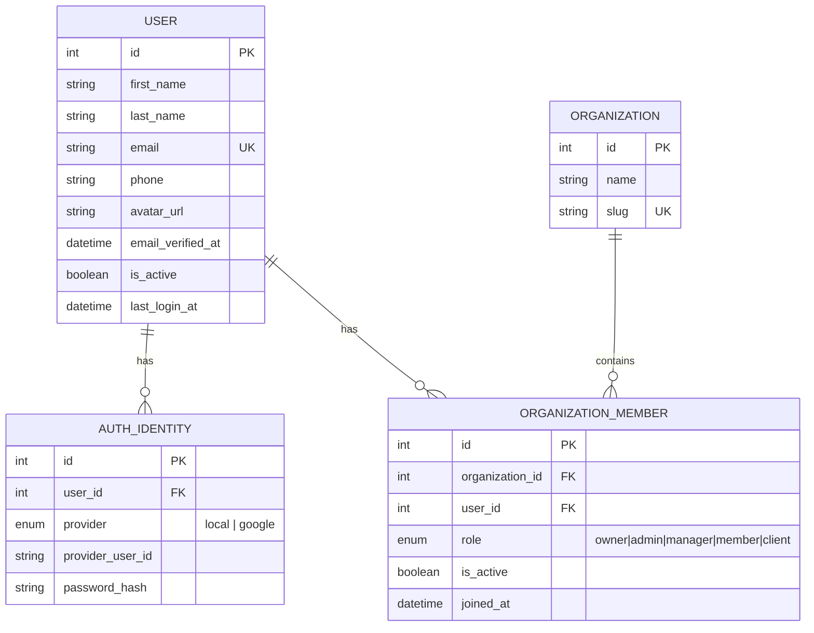

# DATABASE.md — Task Management System

Database: MySQL (dialect configured in [config/db.js](../Task-Manager-Backend/config/db.js) and [config/config.js](../Task-Manager-Backend/config/config.js)). Schema is managed with Sequelize migrations under `Task-Manager-Backend/migrations/`, and mirrored (should mirror) in `Task-Manager-Backend/models/`.

Migration history, in applied order (filenames are timestamped):

1. `20260812060559-create-organizations.js`
2. `20260812062230-create-users.js`
3. `20260812063038-create-auth-identities.js`
4. `20260812063102-create-organization-members.js`

No seeders exist (`seeders/` referenced in `.sequelizerc` but the directory is not present in the repo — ❓ UNKNOWN if it was ever created).

---

## Table: `users`

**Model:** [models/User.js](../Task-Manager-Backend/models/User.js) · **Migration:** [20260812062230-create-users.js](../Task-Manager-Backend/migrations/20260812062230-create-users.js)

**Purpose:** Stores a person's identity/profile — one row per human, independent of any organization or login method.

| Column | Type | Null | Default | Notes |
|---|---|---|---|---|
| id | INTEGER UNSIGNED | No | auto-increment | Primary key |
| first_name | STRING(100) | No | — | |
| last_name | STRING(100) | Yes | — | |
| email | STRING(190) | No | — | **Unique**, validated as email format |
| phone | STRING(20) | Yes | — | |
| avatar_url | STRING(500) | Yes | — | |
| email_verified_at | DATE | Yes | — | Null = unverified. No code currently sets this. |
| is_active | BOOLEAN | No | true | |
| last_login_at | DATE | Yes | — | No code currently updates this on login. |
| created_at | DATE | No | NOW | Sequelize-managed |
| updated_at | DATE | No | NOW | Sequelize-managed |

**Relationships:** `hasMany` → `AuthIdentity` (as `authIdentities`), `hasMany` → `OrganizationMember` (as `organizationMemberships`).

**Used by:** `authController.js` (`register`, `login`) — but see the mismatch noted below; no `password_hash`, `role`, or `organization_id` column exists on this table, despite the controller referencing them.

---

## Table: `organizations`

**Model:** [models/Organization.js](../Task-Manager-Backend/models/Organization.js) · **Migration:** [20260812060559-create-organizations.js](../Task-Manager-Backend/migrations/20260812060559-create-organizations.js)

**Purpose:** Represents a company/tenant ("workspace").

| Column | Type | Null | Default | Notes |
|---|---|---|---|---|
| id | INTEGER UNSIGNED | No | auto-increment | Primary key |
| name | STRING(150) | No | — | |
| slug | STRING(150) | No | — | **Unique**. Generated in the controller as `company_name` lowercased, spaces → `-`, plus a `Date.now()` suffix. |
| created_at | DATE | No | NOW | |
| updated_at | DATE | No | NOW | |

**Relationships:** `hasMany` → `OrganizationMember` (as `members`).

**Used by:** `authController.register` (creates a new org per signup). No `owner_id` column — ownership is implied via an `OrganizationMember.role = 'owner'` row, which the current register flow never creates (see [AUTHENTICATION.md](AUTHENTICATION.md#critical-finding)).

---

## Table: `auth_identities`

**Model:** [models/AuthIdentity.js](../Task-Manager-Backend/models/AuthIdentity.js) · **Migration:** [20260812063038-create-auth-identities.js](../Task-Manager-Backend/migrations/20260812063038-create-auth-identities.js)

**Purpose:** Stores one row per login method a user has (local password, or a future OAuth provider like Google), decoupled from the `users` profile row.

| Column | Type | Null | Default | Notes |
|---|---|---|---|---|
| id | INTEGER UNSIGNED | No | auto-increment | Primary key |
| user_id | INTEGER UNSIGNED | No | — | FK → `users.id`, `ON UPDATE CASCADE`, `ON DELETE CASCADE` |
| provider | ENUM('local', 'google') | No | — | Only `local` is used by any current code path; `google` is modeled but not implemented |
| provider_user_id | STRING(255) | Yes | — | For OAuth providers; unused today |
| password_hash | STRING(255) | Yes | — | Intended home for bcrypt hash — **not currently written by `authController.js`** |
| created_at | DATE | No | NOW | |
| updated_at | DATE | No | NOW | |

**Relationships:** `belongsTo` → `User` (as `user`), FK `user_id`.

**Used by:** ❌ Nothing currently. `authController.js` does not import or reference this model at all, despite it being the correct place to store the password hash.

---

## Table: `organization_members`

**Model:** [models/OrganizationMember.js](../Task-Manager-Backend/models/OrganizationMember.js) · **Migration:** [20260812063102-create-organization-members.js](../Task-Manager-Backend/migrations/20260812063102-create-organization-members.js)

**Purpose:** Join table between `users` and `organizations`; carries the per-organization role. This is the multi-tenancy backbone of the schema.

| Column | Type | Null | Default | Notes |
|---|---|---|---|---|
| id | INTEGER UNSIGNED | No | auto-increment | Primary key |
| organization_id | INTEGER UNSIGNED | No | — | FK → `organizations.id`, CASCADE update/delete |
| user_id | INTEGER UNSIGNED | No | — | FK → `users.id`, CASCADE update/delete |
| role | ENUM('owner','admin','manager','member','client') | No | 'member' | |
| is_active | BOOLEAN | No | true | |
| joined_at | DATE | No | NOW | |
| created_at | DATE | No | NOW | |
| updated_at | DATE | No | NOW | |

**Indexes:** Unique composite index `organization_members_org_user_unique` on `(organization_id, user_id)` — a user cannot have two membership rows in the same organization.

**Relationships:** `belongsTo` → `User` (as `user`), `belongsTo` → `Organization` (as `organization`).

**Used by:** ❌ Nothing currently. No controller creates, reads, updates, or queries this table.

---

## Entity-Relationship Diagram (from actual schema)

No `Project`, `Task`, or any other table exists in the migrations directory — anything beyond the four tables above is 🔵 PROPOSED, not current.

---

## Migration ↔ Model Consistency Check

| Table | Migration matches model? |
|---|---|
| `organizations` | ✅ Yes |
| `users` | ✅ Yes (both omit `password_hash`/`role`/`organization_id` — consistent with each other, but **not** with what `authController.js` assumes) |
| `auth_identities` | ✅ Yes |
| `organization_members` | ✅ Yes |

The schema itself is internally consistent. The mismatch is entirely between the **schema** (correct, normalized) and the **controller code** (`authController.js`, written against an older/flat design). See [AUTHENTICATION.md](AUTHENTICATION.md#critical-finding).
